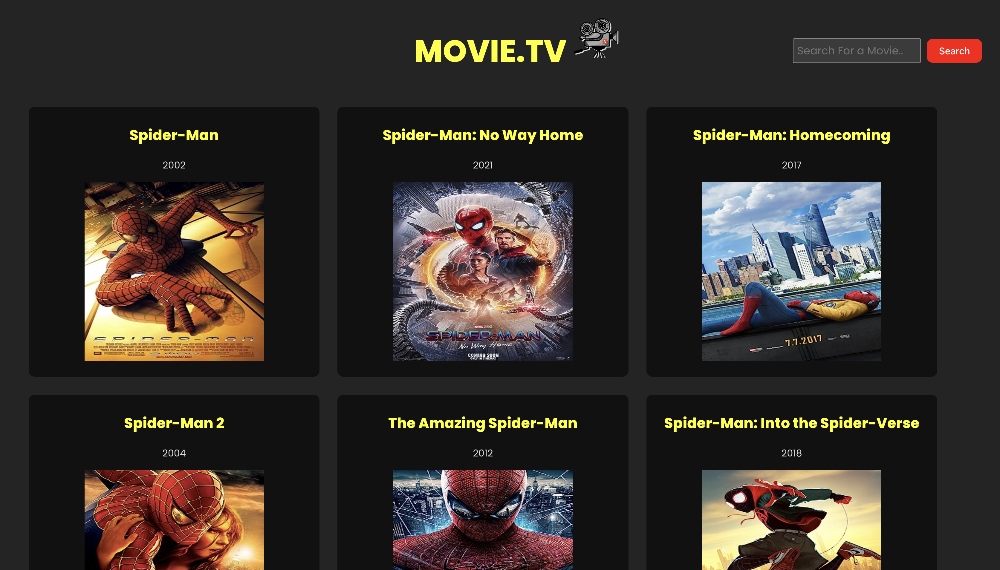
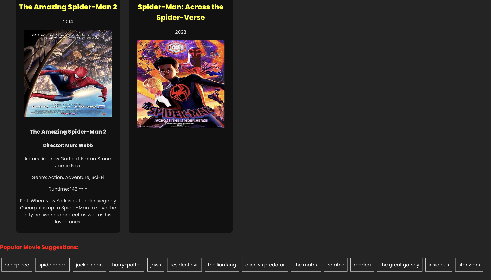

# Movie.tv - Movie API Integration with React.js

## Overview

Movie.tv is a React.js web application that allows users to fetch comprehensive information about any movie using a movie API. In addition to basic movie data like title, poster, and release date, this application fetches extended details such as runtime, plot, director, and more using a secondary API key.

This README file provides an overview of the project, instructions on setting up the development environment, and details on how to use the application.

## Technologies Used

- React.js
- Movie API (requires API key)
- Secondary Movie API for extended details (requires API key)
- JavaScript
- JSX
- CSS

## Usage

1. Enter the title of the movie you want to search for in the search bar.
2. Press the "Search" button or hit Enter.
3. The application will make an API request to fetch basic movie information based on the provided title.
4. Click on the movie poster to fetch extended details like runtime, plot, director, and more using a secondary API key.
5. The fetched movie information will be displayed on the page, providing a comprehensive view of the selected movie.

## Fetching Extended Movie Details

To retrieve extended movie details like runtime, plot, director, and more:

1. After searching for a movie, click on the movie poster.
2. The application will make a second API request using a different API key to fetch additional movie details.
3. The fetched information will be displayed below the movie poster.

This enhancement allows users to access more comprehensive movie data in one click, enriching the user experience.